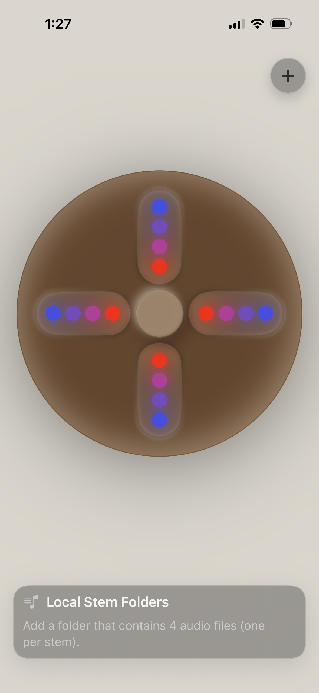
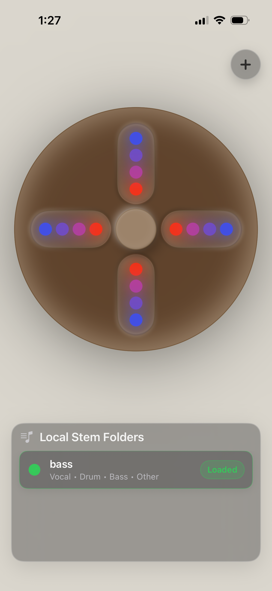

# SwiftUI Stem Player

A modern **Stem Player** built with **Swift/SwiftUI** that allows you to load a folder of audio stems and interactively remix a track. The player automatically maps your stems (e.g., Vocals, Drums, Bass, Other) into an intuitive circular interface, letting you manipulate layers in real-time.

<p align="center">
  
  
</p>

---

## Table of Contents
- [Introduction](#introduction)
- [Features](#features)
- [Installation](#installation)
- [Usage](#usage)
- [Configuration](#configuration)
- [Planned Features](#planned-features)
- [Dependencies](#dependencies)
- [Examples](#examples)
- [Troubleshooting](#troubleshooting)
- [Contributors](#contributors)
- [License](#license)

---

## Introduction

This app is inspired by the idea of interactive music remixing. Instead of listening to a flat audio file, you can **isolate and control individual stems** (Vocals, Drums, Bass, Other layers). Once you press play, you can tweak levels, mute stems, and dynamically reshape the song.

---

## Features

- 🎛 Load local folders with 4 audio stems (Vocal, Drum, Bass, Other).
- 🔄 Automatic stem mapping into a radial SwiftUI controller.
- 🎚 Real-time manipulation of stems during playback.
- 🎵 Supports standard audio file formats (WAV, MP3, etc).
- 🖥 Clean, SwiftUI-driven UI optimized for iOS.

---

## Installation

1. Clone this repository:
   ```bash
   git clone https://github.com/yourusername/stem-player.git
   cd stem-player
````

2. Open the project in **Xcode**:

   ```bash
   open StemPlayer.xcodeproj
   ```

3. Run the project on a simulator or device.

---

## Usage

1. Add a folder containing **4 audio files** (one per stem: Vocal, Drum, Bass, Other).
2. In the app, load your stem folder via **Local Stem Folders**.
3. Once loaded, the stems will map into the **radial stem interface**.
4. Press play and manipulate each stem by adjusting its intensity.

---

## Planned Features

* **AI Stem Splitting**: Import a single track and auto-generate stems with AI.
* **YouTube & SoundCloud Importing**: Grab audio directly from online sources and split into stems.
* Advanced stem mixing tools (effects, filters, etc).

---

## Dependencies

* **Swift** / **SwiftUI**
* **AVFoundation** (for audio playback & mixing)
* Future: AI stem splitting library (TBD)

---

## Examples

* Load a song split into stems.
* Mute vocals to make an instrumental version.
* Isolate the drums for a beat-only experience.
* Adjust bass for live remixing.

---

## Troubleshooting

* **App won’t load stems**: Ensure your folder contains exactly **4 audio files**.
* **Playback issues**: Check that your files are supported audio formats.
* **Stems not mapped correctly**: Rename files clearly as `Vocal`, `Drum`, `Bass`, `Other`.

---
